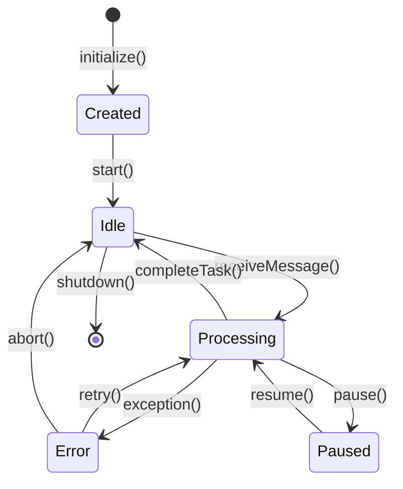
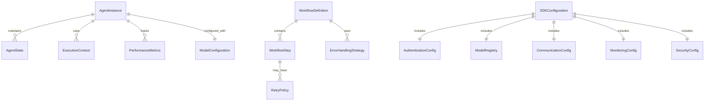

# Data Model: AI Agent SDK

## Core Entities

### Agent Instance
```typescript
interface AgentInstance {
  id: string;
  model: ModelConfiguration;
  state: AgentState;
  context: ExecutionContext;
  performance: PerformanceMetrics;
  createdAt: Date;
  lastActivity: Date;
}

interface ModelConfiguration {
  provider: 'openai' | 'anthropic' | 'google';
  model: string;
  version: string;
  apiKey?: string;
  parameters: Record<string, any>;
  capabilities: ModelCapabilities;
}

interface ModelCapabilities {
  maxTokens: number;
  supportsStreaming: boolean;
  supportsFunctions: boolean;
  supportsVision: boolean;
  maxConcurrency: number;
}

interface AgentState {
  messages: Message[];
  currentWorkflow?: WorkflowState;
  memory: Record<string, any>;
  status: 'idle' | 'processing' | 'error' | 'paused';
}

interface ExecutionContext {
  sessionId: string;
  userId?: string;
  permissions: string[];
  resourceLimits: ResourceLimits;
  timeout: number;
}

interface PerformanceMetrics {
  responseTime: number;
  tokensUsed: number;
  requestsCompleted: number;
  errorRate: number;
  uptime: number;
}

interface ResourceLimits {
  maxMemory: number;
  maxCpu: number;
  maxConnections: number;
  maxTokensPerMinute: number;
}
```

### Workflow Definition
```typescript
interface WorkflowDefinition {
  id: string;
  name: string;
  description: string;
  steps: WorkflowStep[];
  triggers: WorkflowTrigger[];
  errorHandling: ErrorHandlingStrategy;
  parallel: boolean;
}

interface WorkflowStep {
  id: string;
  name: string;
  type: 'task' | 'decision' | 'parallel' | 'subgraph';
  configuration: Record<string, any>;
  inputs: Record<string, any>;
  outputs: Record<string, any>;
  timeout?: number;
  retryPolicy?: RetryPolicy;
}

interface WorkflowTrigger {
  type: 'manual' | 'schedule' | 'event' | 'webhook';
  configuration: Record<string, any>;
}

interface ErrorHandlingStrategy {
  retryAttempts: number;
  backoffStrategy: 'exponential' | 'linear' | 'fixed';
  fallbackAction?: 'abort' | 'retry' | 'human_intervention';
  circuitBreaker?: CircuitBreakerConfig;
}

interface RetryPolicy {
  maxAttempts: number;
  baseDelay: number;
  maxDelay: number;
  jitter: boolean;
}

interface CircuitBreakerConfig {
  failureThreshold: number;
  recoveryTimeout: number;
  halfOpenMaxCalls: number;
}
```

### Message Types
```typescript
interface Message {
  id: string;
  type: 'user' | 'agent' | 'system' | 'error';
  content: string;
  timestamp: Date;
  metadata?: Record<string, any>;
  streaming?: boolean;
}

interface UserMessage extends Message {
  type: 'user';
  userId: string;
  sessionId: string;
}

interface AgentMessage extends Message {
  type: 'agent';
  agentId: string;
  model: string;
  confidence?: number;
}

interface SystemMessage extends Message {
  type: 'system';
  level: 'info' | 'warn' | 'error';
  code?: string;
}

interface ErrorMessage extends Message {
  type: 'error';
  error: ErrorDetail;
  recoverable: boolean;
}

interface ErrorDetail {
  code: string;
  message: string;
  details?: Record<string, any>;
  suggestions?: string[];
}
```

### Configuration Schema
```typescript
interface SDKConfiguration {
  authentication: AuthenticationConfig;
  models: ModelRegistry;
  workflows: WorkflowRegistry;
  communication: CommunicationConfig;
  monitoring: MonitoringConfig;
  security: SecurityConfig;
  versioning: VersioningConfig;
}

interface AuthenticationConfig {
  providers: ProviderConfig[];
  defaultProvider?: string;
  oauth2: OAuth2Config;
  apiKeyRotation: ApiKeyRotationConfig;
}

interface ProviderConfig {
  name: string;
  type: 'openai' | 'anthropic' | 'google';
  endpoint?: string;
  authentication: AuthenticationMethod;
  models: ModelInfo[];
}

interface AuthenticationMethod {
  type: 'api_key' | 'oauth2' | 'bearer_token';
  configuration: Record<string, any>;
}

interface ModelInfo {
  name: string;
  capabilities: ModelCapabilities;
  pricing?: PricingInfo;
  deprecated?: boolean;
}

interface OAuth2Config {
  clientId: string;
  clientSecret?: string;
  scopes: string[];
  redirectUri: string;
  tokenEndpoint: string;
}

interface ApiKeyRotationConfig {
  enabled: boolean;
  rotationInterval: number; // hours
  maxAge: number; // hours
}

interface ModelRegistry {
  defaultModel: string;
  availableModels: Record<string, ModelInfo>;
  autoDetection: boolean;
  fallbackChain: string[];
}

interface CommunicationConfig {
  realtime: RealtimeConfig;
  batching: BatchingConfig;
  connectionPool: ConnectionPoolConfig;
  protocols: ProtocolConfig[];
}

interface RealtimeConfig {
  protocol: 'websocket' | 'sse' | 'long_polling';
  maxLatency: number; // milliseconds
  bufferSize: number;
  heartbeatInterval: number;
}

interface BatchingConfig {
  enabled: boolean;
  maxBatchSize: number;
  maxWaitTime: number; // milliseconds
  flushInterval: number; // milliseconds
}

interface ConnectionPoolConfig {
  maxConnections: number;
  idleTimeout: number; // milliseconds
  maxReuseCount: number;
}

interface ProtocolConfig {
  name: string;
  version: string;
  encryption: boolean;
  compression: boolean;
}

interface MonitoringConfig {
  metrics: MetricsConfig;
  logging: LoggingConfig;
  alerts: AlertConfig[];
  performanceThresholds: PerformanceThresholds;
}

interface MetricsConfig {
  enabled: boolean;
  collectionInterval: number; // milliseconds
  retentionPeriod: number; // hours
  exportFormats: string[];
}

interface LoggingConfig {
  level: 'debug' | 'info' | 'warn' | 'error';
  format: 'json' | 'text';
  structured: boolean;
  compliance: ComplianceConfig;
}

interface ComplianceConfig {
  soc2: boolean;
  gdpr: boolean;
  auditTrail: boolean;
  dataRetention: number; // days
}

interface AlertConfig {
  type: 'performance' | 'error' | 'security';
  threshold: number;
  severity: 'low' | 'medium' | 'high' | 'critical';
  channels: NotificationChannel[];
}

interface NotificationChannel {
  type: 'email' | 'slack' | 'webhook' | 'sms';
  configuration: Record<string, any>;
}

interface PerformanceThresholds {
  maxResponseTime: number; // milliseconds
  maxErrorRate: number; // percentage
  minThroughput: number; // requests per second
  maxMemoryUsage: number; // percentage
}

interface SecurityConfig {
  encryption: EncryptionConfig;
  accessControl: AccessControlConfig;
  auditLogging: boolean;
  dataMasking: boolean;
}

interface EncryptionConfig {
  algorithm: 'AES-256-GCM' | 'ChaCha20-Poly1305';
  keyRotation: boolean;
  atRest: boolean;
  inTransit: boolean;
}

interface AccessControlConfig {
  rbac: boolean;
  permissions: Permission[];
  rateLimiting: RateLimitConfig;
}

interface Permission {
  resource: string;
  actions: ('create' | 'read' | 'update' | 'delete')[];
  conditions?: Record<string, any>;
}

interface RateLimitConfig {
  enabled: boolean;
  requestsPerMinute: number;
  burstLimit: number;
  penaltyStrategy: 'reject' | 'queue' | 'throttle';
}

interface VersioningConfig {
  semantic: boolean;
  autoDetection: boolean;
  compatibilityMatrix: CompatibilityInfo[];
  migrationStrategy: MigrationStrategy;
}

interface CompatibilityInfo {
  fromVersion: string;
  toVersion: string;
  breakingChanges: boolean;
  migrationRequired: boolean;
}

interface MigrationStrategy {
  type: 'automatic' | 'manual' | 'assisted';
  rollbackSupport: boolean;
  dataBackup: boolean;
}

interface WorkflowRegistry {
  workflows: Record<string, WorkflowDefinition>;
  templates: WorkflowTemplate[];
  customWorkflows: boolean;
}

interface WorkflowTemplate {
  name: string;
  description: string;
  category: string;
  steps: WorkflowStepTemplate[];
}

interface WorkflowStepTemplate {
  type: 'task' | 'decision' | 'parallel' | 'subgraph';
  name: string;
  description: string;
  configurationTemplate: Record<string, any>;
}
```

## Validation Rules

### Agent Instance Validation
- `id` must be unique UUID
- `model` must be registered in model registry
- `state` must be serializable for persistence
- `performance.responseTime` must be < 200ms for real-time compliance

### Workflow Validation
- All steps must have valid `id` and `type`
- Circular references are not allowed
- At least one trigger must be defined
- Error handling strategy must be specified for non-trivial workflows

### Configuration Validation
- API keys must match provider-specific format
- OAuth2 configuration must have valid redirect URI
- Rate limits must be positive integers
- Security settings must meet SOC 2 requirements

## State Transitions



## Relationships



This data model provides a comprehensive foundation for implementing the AI Agent SDK with support for multi-model execution, autonomous workflows, real-time communication, and robust configuration management.